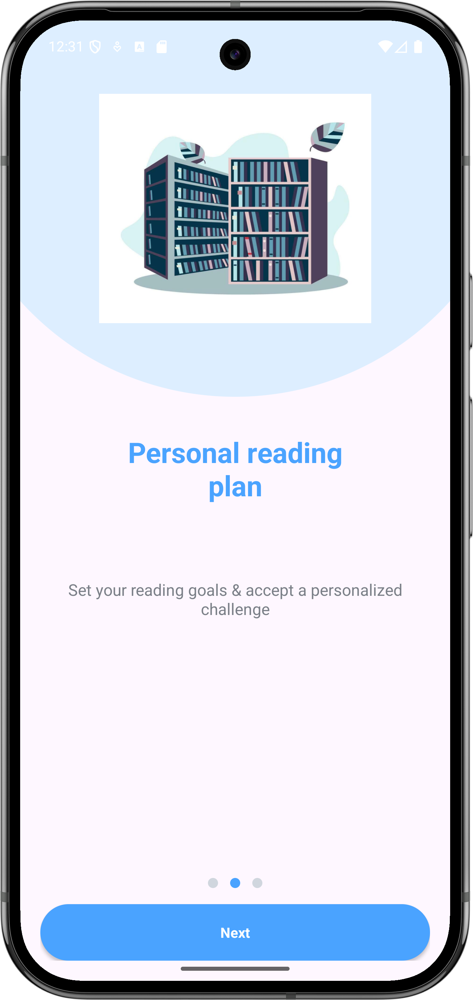
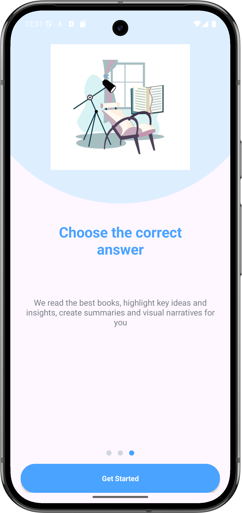
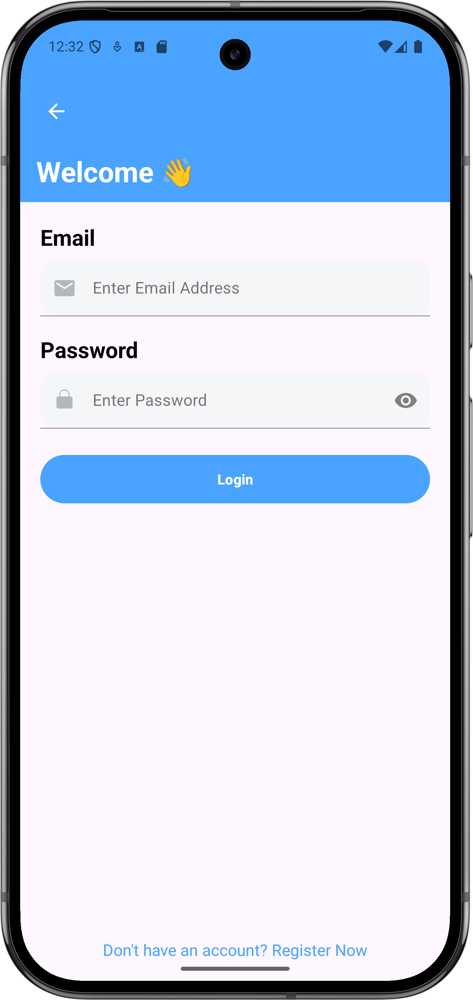
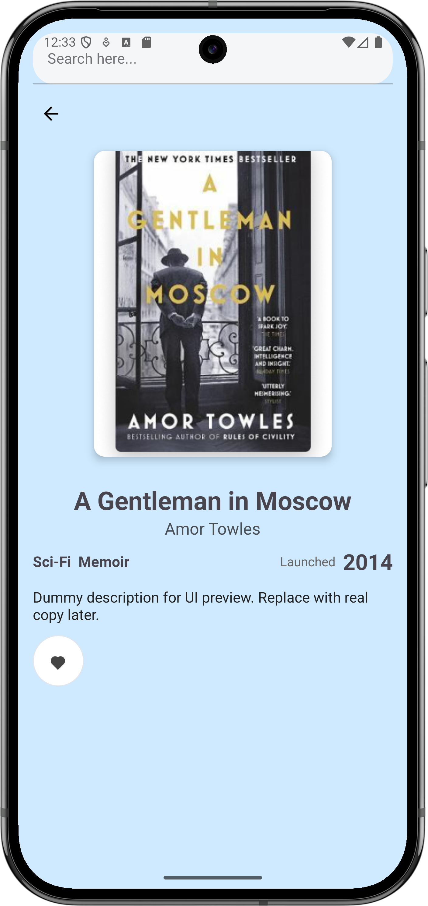
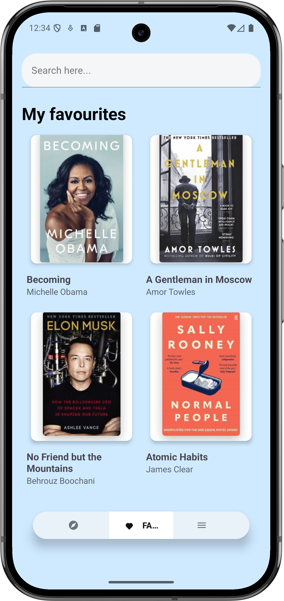
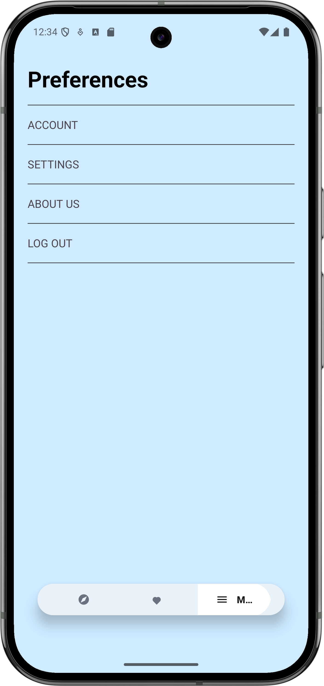
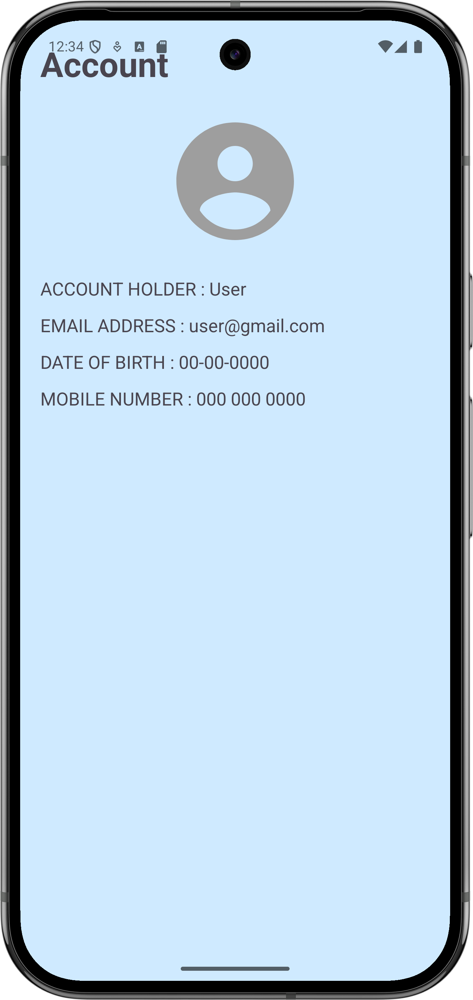

# Bookify App - Figma Design

Mobile Application Development in Figma

## 📱 App Screenshots

### 🚀 Onboarding Experience
| | | |
|:-------------------------:|:-------------------------:|:-------------------------:|
|  |  |  |
| *Read & Watch Anywhere* | *Personal Reading Plan* | *Knowledge Testing* |

### 🔐 Authentication
| | |
|:-------------------------:|:-------------------------:|
|  |  |
| *Welcome Back!* | *Create Account* |

### 📖 Main Features
| | |
|:-------------------------:|:-------------------------:|
|  |  |
| *Personalized Book Discovery* | *Detailed Book View* |

### ⭐ User Profile
| | | |
|:-------------------------:|:-------------------------:|:-------------------------:|
|  |  |  |
| *My Favorites* | *App Preferences* | *Account Details* |

### 🏠 App Launcher

<em>Bookify on Home Screen</em>

## ✨ Features

- Book discovery and reading
- Personalized recommendations
- Favorites collection
- User profile management
- Offline reading capability

## 🛠️ Built With

- Figma for Design
- [Add your tech stack here]

## 📞 Contact

- GitHub: [@Kobitharsan](https://github.com/Kobitharsan)
- Project Link: [https://github.com/Kobitharsan/Bookify_App-Figma_Design](https://github.com/Kobitharsan/Bookify_App-Figma_Design)
